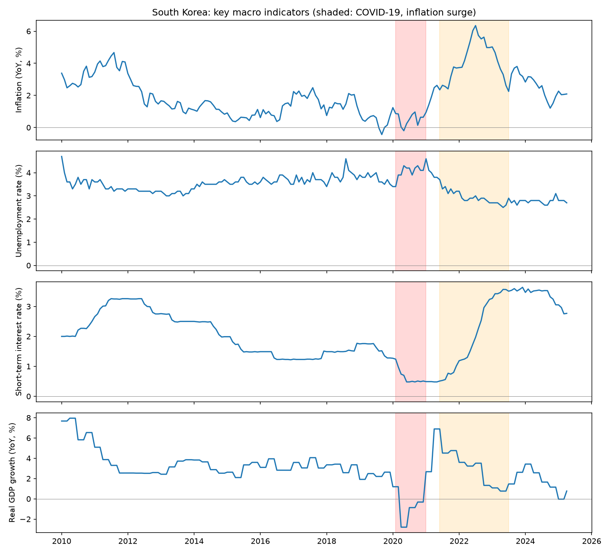
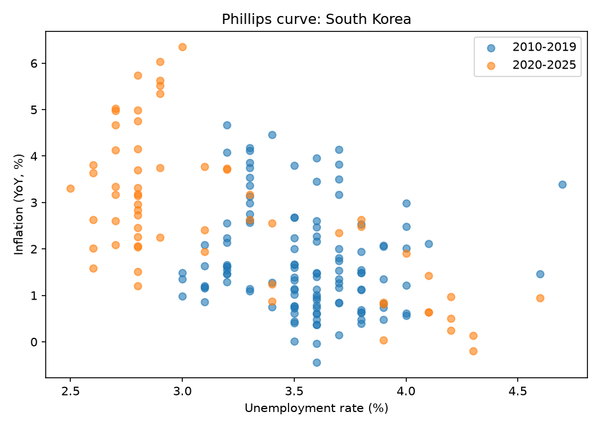
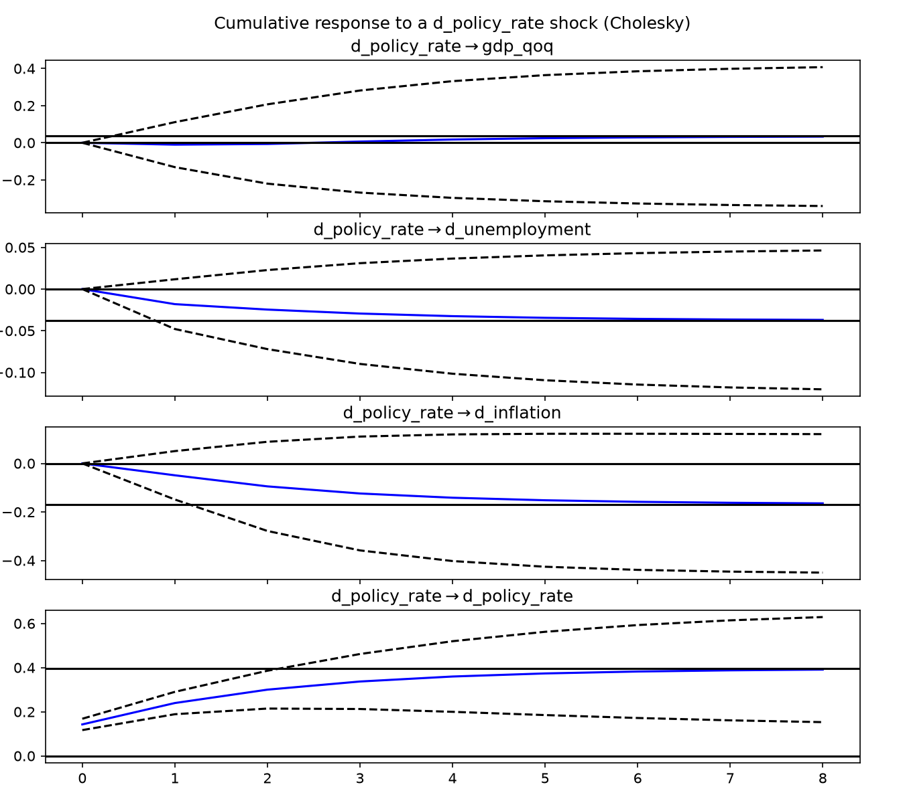
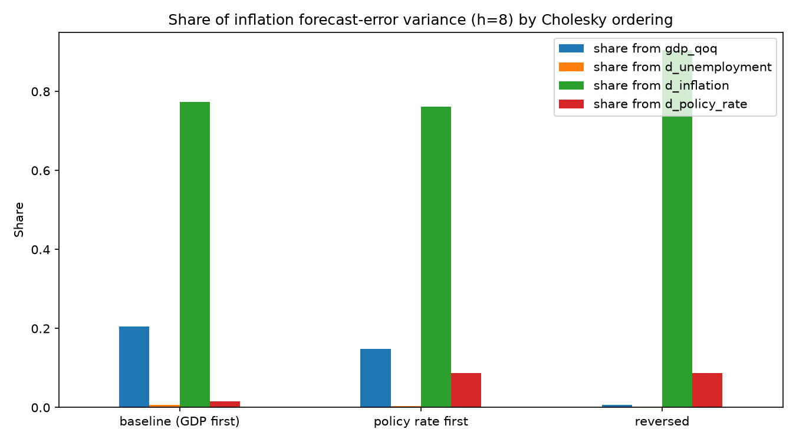
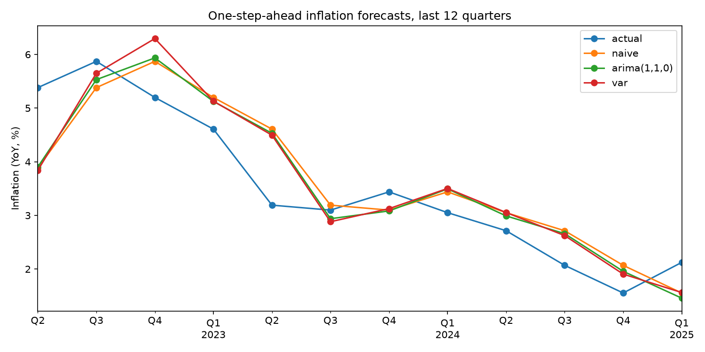

# Inflation, Unemployment & Growth in South Korea: Dynamics and Forecasting (2010-2025)

An end-to-end macroeconometric project: automated data collection from FRED, exploratory analysis, a quarterly VAR with robustness checks, and an out-of-sample forecast comparison.

**Author:** Mohamed El Mahdi Larouci · [LinkedIn](Mohamed El Mahdi Larouci) · [GitHub](mehdilrc)
**Tools:** Python (pandas, statsmodels, matplotlib), SQLite, FRED API

---

## Key takeaways

1. **Inflation leads the policy rate.** In every full-sample specification, past inflation helps predict the short-term interest rate (Granger p between 0.000 and 0.019). This is consistent with a central bank that reacts to inflation.
2. **No evidence that the policy rate moves inflation** within a one- to two-quarter horizon (p between 0.108 and 0.844 in all specifications). This is a statement about the evidence in a short, volatile sample, not proof that monetary policy is ineffective.
3. **The inflation → GDP growth link is fragile.** Significant in the baseline (p = 0.018), it disappears once COVID-19 dummies are added (p = 0.174), so it should not be read as a stable relationship.
4. **No model clearly beats a naive forecast** ("next quarter's inflation = this quarter's") over 2022Q2-2025Q1, a period that includes the inflation surge and its unwinding.

---

## Research questions

1. Does the Phillips curve (inflation vs. unemployment) hold in South Korea, and has it changed after 2020?
2. How did inflation, unemployment, interest rates and growth interact during COVID-19 and the 2021-2023 inflation surge?
3. Can a small VAR forecast inflation better than simple benchmarks?

---

## Data

| Variable | FRED series | Frequency | Notes |
|---|---|---|---|
| Inflation (YoY, %) | `KORCPALTT01CTGYM` | Monthly | OECD; contribution of total CPI to YoY growth, i.e. headline YoY inflation. Available 2010-01 to 2025-04 |
| Unemployment rate (%) | `LRHUTTTTKRM156S` | Monthly | OECD harmonised, 15+ |
| Short-term interest rate (%) | `IRSTCI01KRM156N` | Monthly | Call money / interbank rate (a proxy, not the official base rate) |
| Real GDP | `NGDPRSAXDCKRQ` | Quarterly | Seasonally adjusted, national currency |

**Common window:** 2010-01 to 2025-04 (184 months), limited by the inflation series. The quarterly VAR uses complete quarters only: **2010Q2-2025Q1 (60 quarters, 59 observations after lagging)**.

Data is pulled automatically with `fetch_fred_korea.py`, stored as CSV and in a SQLite database (`data/korea_macro.db`, table `macro_monthly`). Real GDP is quarterly and was forward-filled to months for the descriptive analysis only; the VAR works on genuine quarterly data.

| Indicator (monthly, 2010-2025) | Mean | Min | Max |
|---|---|---|---|
| Inflation (YoY, %) | 2.09 | -0.44 | 6.35 |
| Unemployment (%) | 3.42 | 2.50 | 4.70 |
| Interest rate (%) | 2.08 | 0.48 | 3.64 |
| Real GDP growth (YoY, %) | 2.96 | -2.79 | 7.95 |



---

## Methodology

### 1. Exploratory analysis (`eda_korea.py`)
- Time series with shaded COVID-19 and inflation-surge episodes (approximate dates).
- Correlations and Augmented Dickey-Fuller (ADF) tests.
- Phillips-curve regressions with HAC standard errors.

**Stationarity.** Inflation, unemployment and the interest rate are non-stationary in levels (ADF p = 0.13, 0.51, 0.28) but stationary in first differences (p = 0.029, 0.000, 0.004). GDP growth is stationary in levels (p = 0.027). The VAR therefore uses first differences for the first three variables and quarterly GDP growth.

**Phillips curve (inflation on unemployment, HAC SE):**

| Sample | Slope | p-value | R² | n |
|---|---|---|---|---|
| 2010-2025 | -1.61 | 0.001 | 0.27 | 184 |
| 2010-2019 | -0.51 | 0.452 | 0.02 | 120 |
| 2020-2025 | -1.83 | <0.001 | 0.42 | 64 |

The relationship looks negligible before 2020 and strong afterwards, but this should be read cautiously: the regression uses non-stationary levels (risk of spurious regression), the post-2020 sample is dominated by a single episode, and no control for energy prices or the exchange rate is included.



### 2. Quarterly VAR (`var_korea.py`)
- **Variables (in Cholesky order):** real GDP growth (QoQ, %), Δ unemployment, Δ inflation, Δ policy rate.
- **Lag length:** AIC, BIC, HQIC and FPE all select **1 lag**.
- **Identification:** Cholesky decomposition, ordering real activity → labour market → prices → policy rate. This ordering is an **assumption**; its impact is tested below.
- Outputs: Granger causality, impulse responses (IRF), forecast-error variance decomposition (FEVD).

### 3. Robustness (`robustness_korea.py`)
- COVID-19 dummies (2020Q1-Q2 contraction, 2020Q3-Q4 rebound).
- VAR(2) instead of VAR(1).
- Pre-2020 sample only (38 observations).
- Alternative Cholesky orderings.

### 4. Out-of-sample forecasting
One-step-ahead forecasts of inflation, expanding window, last 12 quarters (2022Q2-2025Q1), compared with a naive benchmark and ARIMA(1,1,0).

---

## Results

### Granger causality across specifications (p-values)

| Specification | n | Inflation → policy rate | Inflation → GDP growth | Policy rate → inflation | Whiteness p | Normality p |
|---|---|---|---|---|---|---|
| Baseline VAR(1) | 59 | 0.019 | 0.018 | 0.335 | 0.045 | 0.000 |
| VAR(1) + COVID dummies | 59 | 0.005 | 0.174 | 0.346 | 0.087 | 0.438 |
| VAR(2) | 58 | 0.000 | 0.007 | 0.108 | 0.054 | 0.013 |
| VAR(2) + COVID dummies | 58 | 0.002 | 0.085 | 0.306 | 0.004 | 0.346 |
| Pre-2020, VAR(1) | 38 | 0.272 | 0.240 | 0.844 | 0.823 | 0.011 |

- All models are stable (roots outside the unit circle).
- Residual normality is rejected in the baseline because of COVID-19 outliers; adding the two dummies resolves it (p = 0.438). **VAR(1) + COVID dummies** passes both residual tests at 5% and is the preferred specification.
- The pre-2020 sample is small and shows little variation in inflation and rates, so non-significance there reflects limited statistical power rather than evidence of no relationship.

### Variance decomposition and Cholesky ordering

Share of inflation forecast-error variance at horizon 8 quarters (baseline VAR(1), no dummies):

| Ordering | From GDP growth | From Δ unemployment | From own shocks | From Δ policy rate |
|---|---|---|---|---|
| GDP first (baseline) | 20.5% | 0.7% | 77.3% | 1.6% |
| Policy rate first | 14.9% | 0.4% | 76.1% | 8.7% |
| Reversed | 0.6% | 0.2% | 90.5% | 8.7% |

The GDP share (0.6% to 20.5%) depends heavily on the ordering, because residuals are correlated (about 0.45 between GDP and inflation). It is therefore **not interpreted as an economic effect**. The cumulative response of inflation to a one-standard-deviation policy-rate shock after 8 quarters is small in all orderings (-0.17 pp in the baseline, about -0.01 pp when the policy rate is ordered first), and no confidence bands were computed, so no significant effect is claimed.




### Forecast comparison (12 quarters, one step ahead)

| Model | RMSE | MAE |
|---|---|---|
| Naive (last value) | 0.747 | 0.630 |
| ARIMA(1,1,0) | 0.724 | 0.609 |
| VAR(1) | 0.754 | 0.623 |

ARIMA improves on the naive forecast by about 3%, and the VAR does not improve on it. With only 12 test observations these differences are not statistically meaningful (no Diebold-Mariano test was run). Forecasting quarterly inflation changes is hard, especially around a large shock.



---

## Limitations

- **Small sample:** 59 quarterly observations for a 4-variable VAR.
- **Structural break:** COVID-19 and the 2021-2023 inflation surge dominate the data; the pre-2020 sub-sample is too short for firm conclusions.
- **Identification:** Cholesky ordering is an assumption, and results for IRF/FEVD depend on it.
- **Omitted variables:** oil prices, the exchange rate and inflation expectations are not included.
- **Proxy policy rate:** the call-money rate is used rather than the official Bank of Korea base rate.
- **Data window:** the inflation series ends in April 2025.
- **Forecast evaluation:** 12 observations, no formal test of predictive accuracy.

## Possible extensions
- Add oil prices and the KRW exchange rate as exogenous variables.
- Confidence bands for impulse responses (bootstrap).
- Diebold-Mariano test for forecast comparison.
- Interactive dashboard (Power BI) for the descriptive results.

---

## Reproducing the analysis

```bash
git clone <this-repo>
cd <this-repo>
pip install -r requirements.txt

# Free API key: https://fred.stlouisfed.org/docs/api/api_key.html
export FRED_API_KEY="your_key"        # Windows PowerShell: $env:FRED_API_KEY="your_key"

python fetch_fred_korea.py    # download and store data
python eda_korea.py           # exploratory analysis, ADF, Phillips curve
python var_korea.py           # quarterly VAR, Granger, IRF, FEVD, forecasts
python robustness_korea.py    # robustness checks
```

## Repository structure

```
├── data/                    # CSV and SQLite database (generated)
├── figures/                 # charts used in this README
├── results/                 # robustness tables (CSV)
├── fetch_fred_korea.py
├── eda_korea.py
├── var_korea.py
├── robustness_korea.py
├── requirements.txt
└── README.md
```

> **Note:** never commit your API key. Use an environment variable or a `.env` file listed in `.gitignore`.

## Data source and licence
Data: OECD Main Economic Indicators, retrieved via FRED (Federal Reserve Bank of St. Louis). Code: MIT licence.
